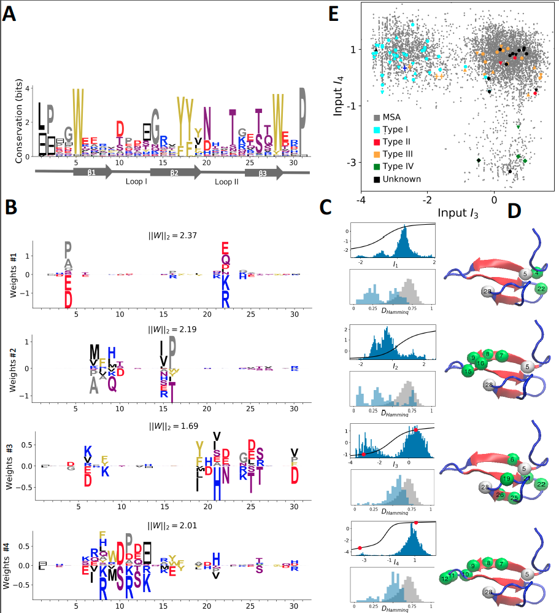

# ProteinMotifRBM

## Summary

Restricted Boltzmann Machines are graphical models that jointly learn a probability distribution and a representation of data. We have recently shown (see https://arxiv.org/abs/1803.08718) that RBM can be tailored to model efficiently distributions of protein sequences within multiple sequence alignments. 

The features inferred by the model are sequence motifs located on coevolving sites that reflect the various structural, functional and phylogenic constraints of the protein. For instance, a sequence motif may be located on two or more sites that are distant in the sequence but in contact on structure and coevolve, e.g. so as to maintain opposite charges. The features may also be related to the protein’s functionality: we find feature localized on a protein’s binding loops, and whose input distribution can separate protein subclasses with different function.

Furthermore, RBM define a probability distribution over sequences that includes pairwise and higher-order interactions. The learnt probability can be used for sequence scoring, contact map prediction and sequence generation. Combining Interpretable features with sequence generation allows to generate sequences with prescribed phenotype.

## Examples:
We provide Jupyter notebooks for training RBM on the Kunitz domain, WW domain, Hsp70 protein and Lattice Proteins, as well as for reproducing the figures 2-7 of the article. Structures were visualised using the software VMD https://www.ks.uiuc.edu/Research/vmd/ (not included). Please see the examples in the notebooks for an introduction to the package.

More specifically:
- Training RBMs: See WW, Kunitz, LP, Hsp70 notebooks
- Visualizing weight logos, input distributions,…: See WW, Kunitz, LP, Hsp70 notebooks
- Contact Prediction: See Kunitz notebook.
- Sequence scoring (likelihood function): See WW, Kunitz, LP notebooks.
- Sequence generation: See WW, Kunitz, LP notebooks.

## Installation:
The package requires a standard Python2.7 installation with numpy, cython, matplotlib,… as well as jupyter notebook. See e.g. https://www.anaconda.com/download/

To run the Hsp70 protein example, please download first the alignment, data & model by running first:

> sh download_Hsp70_data.sh

